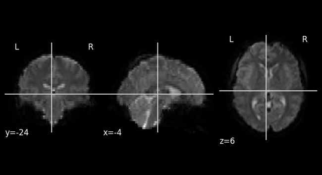

Functional Magnetic Resonance Imaging (fMRI) is a neuroimaging technique that enables the study of brain activity by detecting changes associated with blood flow. Unlike conventional MRI, which provides static images of brain structures, fMRI captures dynamic changes related to neural activity. This technique capitalizes on the Blood Oxygen Level-Dependent (BOLD) signal, which varies with the level of blood oxygenation. Active brain regions consume more oxygen, leading to alterations in the magnetic properties of hemoglobin depending on its oxygenation state. fMRI detects these variations, allowing researchers to identify specific brain areas activated in response to various stimuli or tasks. The data generated are three-dimensional images of the brain, where each voxel corresponds to a time series depicting changes in blood oxygen levels over time, effectively producing a four-dimensional dataset. 

 

Figure 1. Example of output 3D image. Then for every voxel of the image a time series is extracted


fMRI is utilized across diverse disciplines, including medicine, where it assists in neurosurgical planning and the diagnosis of neurological and psychiatric disorders such as epilepsy and schizophrenia. In psychophysiology, fMRI is employed to investigate brain function under normal and pathological conditions, as well as to study cognitive processes like memory, attention, and language.

A central objective in fMRI research is the classification of human brain states based on functional activity, as reflected in the BOLD signal. fMRI data are collected during resting states and during engagement in various tasks (e.g., solving cognitive problems), under both normal and pathological conditions, and across different levels of consciousness (e.g., wakefulness, sleep, anesthesia, coma). In clinical settings, accurately classifying pathological brain states is of paramount importance. Employing machine learning techniques to classify brain states presents a promising avenue for research. To effectively apply these methods to complex conditions—such as differentiating between healthy individuals and patients with schizophrenia, or among subtypes of schizophrenia—it is essential to validate their performance on simpler cases. A notable challenge with fMRI data is its high variability, originating from multiple sources, including differences in data acquisition protocols. Consequently, data acquired from different scanners and by different technicians may vary significantly, complicating model generalization across datasets.

## Task:

One fundamental state of the human brain is the resting state with either eyes open or eyes closed. It is well-established that these states exhibit differences, particularly affecting the brain's visual cortex and associated structures. Experts can distinguish between these states through visual inspection of fMRI data. The objective of this research is to determine whether machine learning (ML) or deep learning (DL) approaches can accurately differentiate between these states. It is especially important to develop a model that can be trained on one dataset (e.g., publicly available data) and applied to proprietary data (e.g., clinical data from a specific institution).

This project proposes the development of an effective methodology for classifying resting states with eyes open and eyes closed using machine learning techniques. Two datasets are provided: data from various research projects at the Institute of the Human Brain of the Russian Academy of Sciences (IHB RAS) and an open dataset from Beijing Normal University. Both datasets consist of fMRI scans under two conditions—eyes closed and eyes open—and are presented as time-series data. Given the high dimensionality of raw fMRI data (e.g., $120 \times 142 \times 50$ voxels in the IHB dataset), dimensionality reduction is commonly performed using brain atlases. These atlases partition the brain into regions corresponding to specific anatomical structures, allowing for the averaging of time series across all voxels within a region.
The predominant approach for training machine learning models on fMRI data involves the use of functional connectivity matrices. These matrices represent the similarity between the time-series data of different brain regions, typically calculated using pairwise Pearson correlation coefficients. The underlying assumption is that co-activated regions will exhibit similar temporal signals. Alternatively, raw time-series data can be utilized directly, or different similarity metrics can be employed to construct functional connectivity matrices.

## Data Overview

**Training Data:**

```
Beijing dataset: 
    47 participants with eyes open, 95 participants with eyes closed
IHB dataset: 
    10 participants with eyes open, 10 participants with eyes closed
```

**Public Test Data:**

```
IHB dataset: 
    20 participants with eyes open, 20 participants with eyes closed
```

**Private Test Data:**

```
IHB dataset: 
    117 participants with eyes open, 117 participants with eyes closed
```

Note that test dataset contains data from different experiments. 
Therefore, the performance on private and public sets can be very different. 
Later in the baseline notebook you will see that there is a great difference in how the models perform on different datasets. 
Still the data shows the same thing — difference between opening and closing the eyes. 

## Objective

The task aims to simulate a realistic research workflow:

```
-  Data Collection Constraints: Collecting fMRI data is challenging and costly, 
   resulting in small proprietary datasets.
-  Utilization of Public Datasets: Numerous publicly available datasets 
   can be utilized for pre-training models.
-  Dataset Variability: These open datasets inherently differ from proprietary data 
   in aspects such as scanner type, geographic location of data collection, 
   and average age of participants.
```

The primary goal is to develop a model capable of generalizing across multiple datasets from diverse sources. While the difference between eyes open and eyes closed resting states is evident at the individual subject level, it is less pronounced in group analyses. Therefore, the model must be robust enough to detect these subtle differences across heterogeneous datasets.

## Performance Metric and Deliverables

Evaluation Metric: **Accuracy score**.

```
Required Deliverables:
-  Model Weights: The trained model's weights for reproducibility and further analysis.
-  Executable Script: A script containing all necessary code to run the model, 
   including data preprocessing steps, model architecture, training procedures, 
   and evaluation metrics.
```
